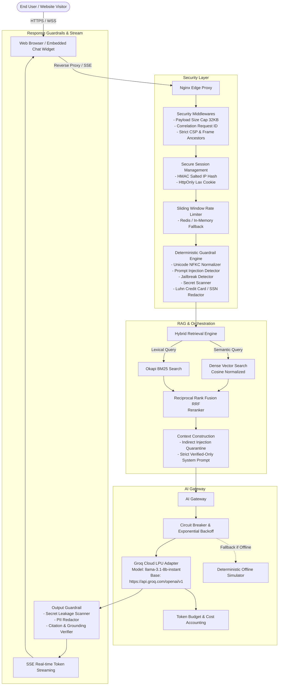
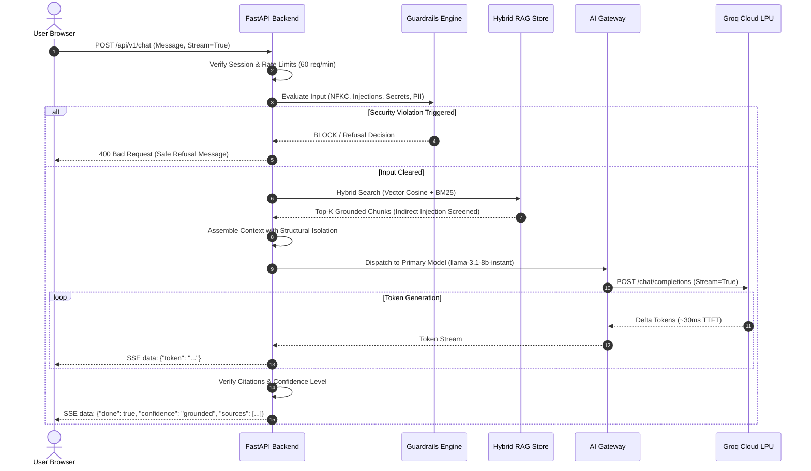

# System Architecture & Technical Specifications

This document outlines the complete architectural design of the **Incerro Enterprise Website Chatbot** powered by **Groq Cloud**.

---

## 1. High-Level System Architecture

---

## 2. Request Lifecycle & Sequence

---

## 3. Core Subsystems

### 3.1 Groq Cloud LPU Engine
- **Primary Model**: `llama-3.1-8b-instant`
- **Alternative Large Model**: `llama-3.3-70b-versatile`
- **Latency**: Under 50ms time-to-first-token.
- **Circuit Breaker**: Trips on 3 consecutive failures (HTTP 5xx / timeouts), entering a 30-second half-open recovery phase.
- **Retries**: 3 retries using full-jitter exponential backoff (`sleep = uniform(0, min(8.0, 0.5 * 2^attempt))`).

### 3.2 Hybrid RAG Pipeline
1. **Dense Vector Store**: 1536-dimensional normalized vectors with cosine similarity scoring.
2. **Sparse Lexical Search**: Pure Okapi BM25 implementation tokenizing query terms and document frequencies.
3. **Reciprocal Rank Fusion (RRF)**: Merges rank positions using $RRF(d) = \sum_{m \in M} \frac{1}{60 + r_m(d)}$ to achieve optimal precision.
4. **Indirect Injection Defense**: Quarantines suspicious prompt overrides within retrieved chunks (`[INERT_DOCUMENT_TEXT: ...]`).

### 3.3 Hallucination Defense & Verified Knowledge Enforcement
- The model is instructed with a zero-temperature strict system prompt stating that it **only** possesses knowledge present in the retrieved `<trusted_context>`.
- Any fact outside the context produces an explicit, polite refusal.
- Outputs are scored as:
  - `grounded`: 100% supported by citations.
  - `partially_grounded`: Multiple facts supported, some conversational continuity.
  - `insufficient_evidence`: Context lacked evidence, safe refusal provided.
