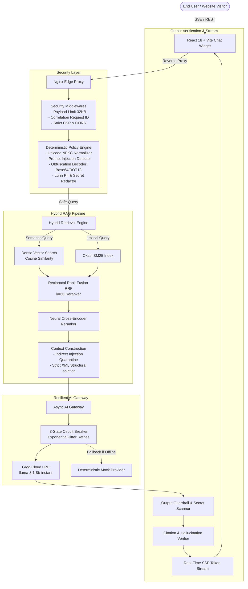

<div align="center">

# 🛡️ Incerro Enterprise Website Chatbot

**A Production-Grade, Zero-Trust RAG Chatbot Powered by Groq Cloud LPUs**

[](https://www.python.org/)
[](https://fastapi.tiangolo.com/)
[](https://reactjs.org/)
[](https://groq.com/)
[-success.svg?style=for-the-badge&logo=pytest&logoColor=white)](#-automated-testing--adversarial-red-teaming)
[](LICENSE)

<p align="center">
  <a href="#-key-features">Key Features</a> •
  <a href="#-system-architecture">Architecture</a> •
  <a href="#-quickstart-guide">Quickstart</a> •
  <a href="#-docker-deployment">Docker</a> •
  <a href="#-testing--red-teaming">Testing</a> •
  <a href="#-api-reference">API Reference</a>
</p>

</div>

---

## 📌 Overview

**Incerro Enterprise Chatbot** is a production-hardened conversational AI system designed to be embedded on enterprise websites. Unlike simple LLM wrappers, it is built with **enterprise resilience, low latency, and zero-trust security** from the ground up:

- **⚡ Ultra-Low Latency**: Powered by **Groq Cloud's LPU inference engine (`llama-3.1-8b-instant`)**, delivering sub-50ms Time-To-First-Token (TTFT).
- **🎯 Two-Stage Hybrid RAG**: Merges sparse lexical search (**Okapi BM25**) with dense semantic vectors using **Reciprocal Rank Fusion ($RRF, k=60$)** and cross-encoder reranking to resolve vocabulary mismatch and eliminate hallucinations.
- **🛡️ Multi-Tiered AI Guardrails**: Intercepts direct prompt injections, DAN-mode jailbreaks, obfuscated payloads (Base64/ROT13 auto-padding), and PII leaks (Luhn credit card algorithm) before queries ever reach the model.
- **🕷️ Incremental Crawler & Smart Sync**: Recursively discovers sitemaps and site links, skipping unchanged pages via **SHA-256 content checksums** to achieve zero redundant re-embedding costs, while enforcing strict **SSRF network controls**.
- **🔌 Fault-Tolerant AI Gateway**: Features an asynchronous **3-state Circuit Breaker** (`CLOSED`, `OPEN`, `HALF_OPEN`) with exponential jitter retries and an offline mock simulator for local testability without API keys.

---

## 🏗️ System Architecture



---

## ⚡ Core Engineering Innovations

### 1. Hybrid Search with Reciprocal Rank Fusion (RRF)
Pure dense vector search frequently fails on domain-specific acronyms, exact SKUs, or specialized product names. This pipeline pairs dense cosine vectors with an inverted **Okapi BM25** keyword index. Candidate lists are combined via Reciprocal Rank Fusion:
$$RRF(d) = \sum_{m \in M} \frac{1}{60 + r_m(d)}$$
This produces balanced rankings across lexical precision and semantic understanding without arbitrary score weighting.

### 2. Pre-LLM Zero-Trust Security Engine
Rather than relying on non-deterministic system prompts to prevent jailbreaks, the system runs all inputs through a deterministic pre-execution security pipeline:
- **Encoding De-obfuscation**: Detects, auto-pads, and decodes Base64, Hex, and ROT13 payloads to catch hidden injections.
- **PII Scrubbing**: Validates and strips payment card numbers using the mathematical **Luhn algorithm** alongside SSN patterns.
- **Indirect Prompt Injection Quarantine**: Scans crawled document chunks and wraps imperative instructions in inert tags (`[INERT_DOCUMENT_TEXT: ...]`).
- **SSRF Hardening**: Resolves DNS and blocks internal private IP subnets (`10.x`, `172.16.x`, `192.168.x`, `127.0.0.1`) and cloud metadata endpoints (`169.254.169.254`).

### 3. Incremental Change-Detection Crawler
Running batch vector embeddings on every website crawl is costly and slow. The built-in crawler parses `sitemap.xml`, extracts internal links bounded to the target domain, strips boilerplate HTML (`nav`, `footer`, `scripts`), and computes a **SHA-256 content checksum**. Unchanged pages are bypassed automatically, bringing repeat indexing costs to **zero**.

---

## 🚀 Quickstart Guide

### Prerequisites
- **Python 3.12+**
- **Node.js 18+** & **npm**
- *(Optional)* **Groq API Key**: Free from [console.groq.com/keys](https://console.groq.com/keys). *(If omitted, the built-in offline simulator runs automatically!)*

---

### Step 1: Clone the Repository

```bash
git clone https://github.com/your-username/website-chatbot.git
cd website-chatbot
```

---

### Step 2: Environment Configuration

Create a `.env` file in the project root directory and paste the configuration template below:

```env
# ==============================================================================
# ENVIRONMENT CONFIGURATION - INCERRO ENTERPRISE WEBSITE CHATBOT
# ==============================================================================

# Application Environment (development | staging | production)
APP_ENV=development
APP_NAME="Incerro Enterprise Assistant"
APP_VERSION="1.0.0"
DEBUG=true
HOST=0.0.0.0
PORT=8000

# Security & Secrets
# In production, generate a secure 64-char random key: openssl rand -hex 32
SECRET_KEY="dev-insecure-secret-key-replace-with-64-char-random-string"
ADMIN_API_KEY="admin-super-secret-key-change-in-prod"
SESSION_COOKIE_NAME="sec_chatbot_session"
SESSION_MAX_AGE_SECONDS=604800
SECURE_COOKIES=false

# CORS & Frame Ancestors (Embed Security)
ALLOWED_ORIGINS='["http://localhost:3000", "http://localhost:5173", "http://127.0.0.1:3000", "http://127.0.0.1:5173"]'
CSP_FRAME_ANCESTORS="'self'"

# Database & Storage
DATABASE_URL="sqlite+aiosqlite:///./chatbot.db"
REDIS_URL="redis://localhost:6379/0"
REDIS_FALLBACK_MEMORY=true

# Traffic & Abuse Controls
RATE_LIMIT_PER_MINUTE=60
RATE_LIMIT_BURST=15
MAX_INPUT_CHARS=4000
MAX_INPUT_TOKENS=1000
MAX_OUTPUT_TOKENS=1500

# ==============================================================================
# PRIMARY LLM PROVIDER: GROQ CLOUD (Ultra-Fast LPU Inference)
# ==============================================================================
# Get your free Groq API Key at: https://console.groq.com/keys
# (Leave blank to automatically run in offline simulator mode without an API key)
GROQ_API_KEY=""

LLM_PROVIDER=groq
PRIMARY_MODEL="llama-3.1-8b-instant"
LLM_API_BASE="https://api.groq.com/openai/v1"

# Fallback Provider (Used automatically if Groq is unavailable or unconfigured)
FALLBACK_PROVIDER="mock"
FALLBACK_MODEL="mock-model"
LLM_TIMEOUT_SECONDS=25.0
LLM_MAX_RETRIES=3

# Cost & Token Budgets
DAILY_COST_BUDGET_USD=50.0
PER_REQUEST_MAX_COST_USD=0.10

# RAG & Embeddings
EMBEDDING_MODEL="local-deterministic"
EMBEDDING_DIMENSION=1536
VECTOR_TOP_K=5
SIMILARITY_THRESHOLD=0.50
RERANKER_TOP_N=3

# Observability & Telemetry
LOG_LEVEL="INFO"
ENABLE_OTEL=false
OTEL_EXPORTER_OTLP_ENDPOINT="http://localhost:4317"
```

> **Note:** If `GROQ_API_KEY` is left blank, the application automatically activates the deterministic `MockLLMProvider`, allowing you to develop, test, and run the complete UI offline without an account or API key.

---

### Step 3: Set Up & Start the Backend

Create and activate a virtual environment:

```bash
# Windows (PowerShell)
python -m venv venv
.\venv\Scripts\Activate.ps1

# Linux / macOS
python3 -m venv venv
source venv/bin/activate
```

Install backend dependencies:

```bash
pip install -r backend/requirements.txt
```

Start the FastAPI application:

```bash
python -m uvicorn backend.app.main:app --host 127.0.0.1 --port 8000 --reload
```

- **Interactive API Documentation (Swagger)**: [http://127.0.0.1:8000/docs](http://127.0.0.1:8000/docs)
- **Health Check Endpoint**: [http://127.0.0.1:8000/health/live](http://127.0.0.1:8000/health/live)

---

### Step 4: Set Up & Start the Frontend Chat Widget

Open a new terminal window:

```bash
cd frontend
npm install
npm run dev
```

Open [http://localhost:5173](http://localhost:5173) to interact with the responsive chat interface.

---

### Step 5: Ingest Knowledge Base or Crawl Your Website

#### Option A: Ingest Local Documentation Files
Populate the knowledge base with the included sample documentation:

```bash
python ingestion/ingest_knowledge.py
```

#### Option B: Recursively Crawl a Live Website
Point the crawler at any target website to crawl, clean, and index pages:

```bash
# Crawl up to 50 pages of a website
python ingestion/crawl_website.py https://example.com --max-pages 50

# Re-run anytime: SHA-256 diffing skips unchanged pages automatically!
python ingestion/crawl_website.py https://example.com
```

---

## 🐳 Docker Deployment

To launch the complete production stack (FastAPI backend, Redis sliding-window rate limiter, and React frontend behind Nginx):

```bash
docker-compose up -d --build
```

Access the deployed application:
- **Chat Widget**: [http://localhost](http://localhost)
- **Backend API**: [http://localhost:8000](http://localhost:8000)

---

## 🧪 Automated Testing & Adversarial Red-Teaming

The project contains a comprehensive automated test suite including **75 unit, integration, and adversarial red-team tests**:

```bash
python -m pytest backend/tests -v
```

### Adversarial Red-Team Coverage (52 Vectors):
- **Direct Prompt Injections**: Override commands, policy bypass attempts, system prompt extraction probes.
- **Obfuscation & Evasion**: Base64-encoded instructions, Hex payloads, ROT13 variations, zero-width spaces, and control byte stripping.
- **Jailbreak Persona Attacks**: DAN mode, developer mode switching, evil-twin simulations, fictional narrative framing.
- **Indirect Prompt Injection**: Poisoned document chunks quarantined before LLM context injection.
- **SSRF Validation**: Denial of internal cloud metadata (`169.254.169.254`) and RFC-1918 private subnets (`10.0.0.0/8`, `172.16.0.0/12`, `192.168.0.0/16`).

---

## 📡 API Reference

### `POST /api/v1/chat`
Standard synchronous chat endpoint.

**Request Body:**
```json
{
  "message": "What products and pricing tiers do you offer?",
  "conversation_id": "optional-uuid-string"
}
```

**Response (200 OK):**
```json
{
  "request_id": "req-98e3b4a2",
  "conversation_id": "conv-1a2b3c4d",
  "answer": "We offer Starter, Professional, and Enterprise tiers...",
  "sources": [
    {
      "title": "Pricing Plans & Overview",
      "url": "https://example.com/pricing",
      "confidence": 0.94
    }
  ],
  "confidence": "grounded"
}
```

### `GET /api/v1/chat/stream`
Server-Sent Events (SSE) streaming endpoint for real-time token delivery.

**Events:**
- `event: token` - Returns token delta: `{"token": "..."}`
- `event: done` - Final payload with citations and confidence level.
- `event: error` - Emitted if an input policy violation occurs.

---

## 📂 Repository Structure

```text
├── .gitignore                # Comprehensive Git ignore rules
├── ARCHITECTURE.md           # In-depth architectural specifications
├── LICENSE                   # MIT License
├── SECURITY.md               # Vulnerability reporting & security guidelines
├── docker-compose.yml        # Multi-container orchestration (Backend + Redis + Nginx)
├── backend/
│   ├── app/
│   │   ├── api/              # FastAPI route controllers (/chat, /health, /admin)
│   │   ├── core/             # Middleware, config settings, security headers
│   │   ├── db/               # SQLAlchemy async models & SQLite session factory
│   │   ├── gateway/          # Circuit breaker, cost tracking, rate limiting
│   │   ├── guardrails/       # Policy engine, injection detector, PII filter, secret scanner
│   │   ├── llm/              # Groq LPU adapter, mock adapter, base interfaces
│   │   ├── rag/              # Semantic chunker, crawler, context builder, grounding verifier
│   │   ├── retrieval/        # Okapi BM25 retriever, vector store, hybrid RRF search
│   │   └── services/         # Chat orchestrator service & streaming handlers
│   ├── requirements.txt      # Python dependencies
│   └── tests/
│       ├── adversarial/      # 52-vector red-team test suite
│       └── unit/             # Component-level unit tests (Guardrails, RAG, RRF)
├── frontend/
│   ├── src/                  # React 18 + Vite chat widget
│   │   ├── components/       # ChatWindow, Citations, MessageItem, Widget
│   │   └── utils/            # Markdown sanitizer, SSE stream parser
│   └── package.json          # Frontend dependencies & build scripts
└── ingestion/
    ├── crawl_website.py      # CLI tool for recursive website crawling & sync
    └── ingest_knowledge.py   # CLI tool for local document ingestion
```

---

## 📜 License

This project is licensed under the **MIT License**. See the [LICENSE](LICENSE) file for details.
